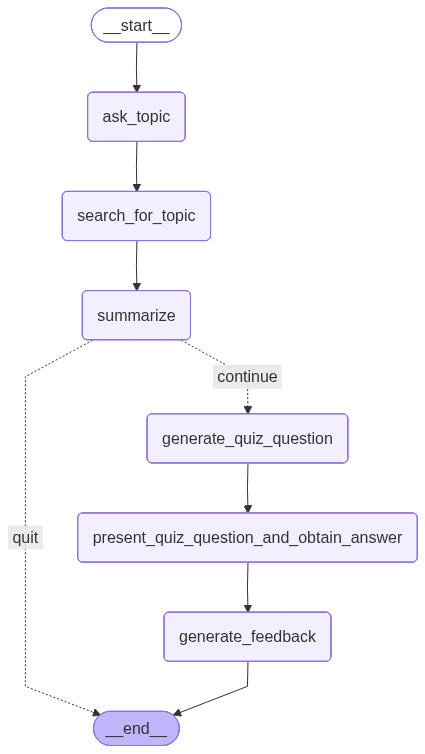

# Healthbot

### An interactive chatbot that helps you learn about healh topics

Final project from Udacity course "AI Agents with LangChain and LangGraph" https://www.udacity.com/enrollment/cd13764. 10/11/25


### Workflow:

1. Ask user to enter a health topic they would like to learn about.
2. Search the web for resources on the topic.
3. Summarize the findings and present them to the user for study.
4. Once user is ready to continue, present a quiz question to test their comprehension of the material.
5. Obtain the user's answer to the quiz question.
6. Present a letter grade and an explanation to the user to help reinforce learning.
7. Ask user if they would like to learn about another topic.


<p align="center">
  
</p>


### Requirements

- Python version as specified in `.python-version`
- `uv` (Universal Python package manager) for dependency management
- Tavily API key for web search functionality
- OpenAI API key (optional, required only if using the default OpenAI model)


### Setup

To set up and run the project on a new machine using uv, follow these steps:

1. **Clone the repository:**

```
git clone https://github.com/jmsbutcher/healthbot.git
cd healthbot
```

2. **Install uv:**
If you don’t have uv installed, install it according to the official instructions (e.g., via pip or from source). E.g., `pip install uv`

3. **Set up the Python environment:**
Use the .python-version file to configure the correct Python version with uv:
```
uv sync --with .python-version
```

4. **Install dependencies:**
Use the uv.lock and pyproject.toml files to install all project dependencies:
```
uv sync
```

5. **Create a .env file:**
In the top-level directory, create a .env file containing:
* **Tavily API key** (Required) - For web search step. `TAVILY_API_KEY=<your api key>`
* **Open AI API key** (Optional) - Only required if using the default OpenAI model (See LLM Models below) `OPENAI_API_KEY=<your api key>`

6. **Run the project:**
Execute the main script using `uv`
```
uv run app.py
```


### LLM Models:

You can select which model to use using the `get_model(model_name: str)` function in src/model.py, calling it with a different argument in src.workflow.py, e.g., `model = get_model("ollama")`.

Currently has *OpenAI* and *Ollama's llama3.1:8b* models built-in by default.


